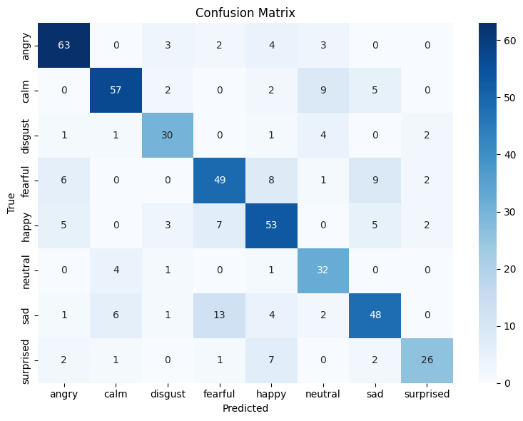

# 🎙️ Emotion Recognition from Audio using Deep Learning

This project detects emotions from audio clips (both **speech** and **song**) using the **RAVDESS** dataset. It includes:

-   A complete **data pipeline**
-   A **hybrid deep learning model** (Conv1D + LSTM)
-   A trained model saved in `.h5` format
-   A fully functional **Streamlit web app**
-   A testable Python script
-   Requirements and documentation for reproducibility

---

## 🧠 Project Description

This project builds a deep learning model to classify emotions in audio files using the **RAVDESS** dataset. Emotions detected:

-   Neutral
-   Calm
-   Happy
-   Sad
-   Angry
-   Fearful
-   Disgust
-   Surprised

The final model is deployed as a **Streamlit web app** where users can upload a `.wav` file and get the predicted emotion in real-time.

---

## ⚙️ Preprocessing Methodology

-   Loaded audio clips from both speech and song folders
-   Extracted emotion labels from filenames
-   Used `librosa` to extract **MFCCs** (40 features) per file

```python
     def extract_mfccs(filename):
     y, sr = librosa.load(filename, duration=3, offset=0.5)
     mfccs = np.mean(librosa.feature.mfcc(y=y, sr=sr, n_mfcc=40).T, axis=0)
     return mfccs

    features = []
    label_values = []

    for _, row in df_combined.iterrows():
        path = row['path']
        label = row['labels']
        mfcc = extract_mfccs(path)

        if mfcc is not None:
            features.append(mfcc)
            label_values.append(label)
```

-   Applied **RandomOverSampler** to balance training data
-   Encoded labels using `LabelEncoder` and `to_categorical`
-   Reshaped MFCCs into 3D shape suitable for LSTM input

---

## 🧩 Model Pipeline

We used a **hybrid CNN + LSTM architecture**:


-   Optimizer: Adam

-   Loss: Categorical Crossentropy

-   Regularization: Dropout + Batch Normalization

-   EarlyStopping & ReduceLROnPlateau callbacks used

```python
    model = Sequential([
    Conv1D(128, kernel_size=3, activation='relu', padding='same', input_shape=(40, 1)),
    BatchNormalization(),
    MaxPooling1D(pool_size=2),
    Dropout(0.2),

    Conv1D(256, kernel_size=3, activation='relu', padding='same'),
    BatchNormalization(),
    MaxPooling1D(pool_size=2),
    Dropout(0.2),

    Conv1D(256, kernel_size=3, activation='relu', padding='same'),
    BatchNormalization(),
    MaxPooling1D(pool_size=2),
    Dropout(0.2),
    LSTM(128, return_sequences=True),
    LSTM(256, return_sequences=True),
    Dropout(0.3),
    LSTM(64),

    Dense(len(label_encoder.classes_), activation='softmax')
])
```

## Accuracy Metrics

-   f1 Score

```text
Classification Report:
              precision    recall  f1-score   support

       angry       0.81      0.84      0.82        75
        calm       0.83      0.76      0.79        75
     disgust       0.75      0.77      0.76        39
     fearful       0.68      0.65      0.67        75
       happy       0.66      0.71      0.68        75
     neutral       0.63      0.84      0.72        38
         sad       0.70      0.64      0.67        75
   surprised       0.81      0.67      0.73        39

    accuracy                           0.73       491
   macro avg       0.73      0.73      0.73       491
weighted avg       0.73      0.73      0.73       491
```

-   confusion matrix



## 🚀 Streamlit Web App

Launch the web app with: https://emotionclassification-4jyckjv2krbaq2m89uf6zw.streamlit.app/

```bash
streamlit run app.py
```

Upload a .wav file to get real-time emotion prediction. Model supports both speech and song clips.

## 📦 Requirements

Install dependencies using:

```bash
    pip install -r requirements.txt
```

## 📹 Demo Video

    A video demonstration of the web app usage is included in https://drive.google.com/file/d/12PmQ4pcxa89-KhkkD1c_zUqjdigqExtX/view?usp=sharing.
